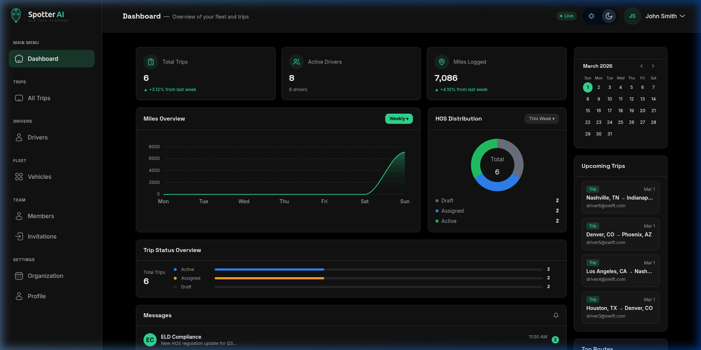
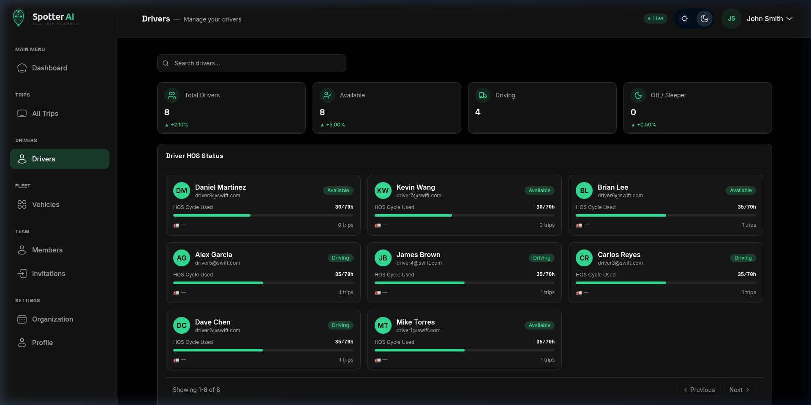
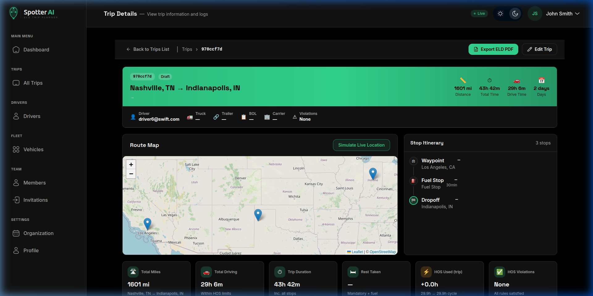

# Spotter AI — ELD Trip Planner API ⚙️

<p align="center">
  
</p>

<p align="center">
  
</p>

<p align="center">
  <strong>High-performance Django REST Python API powering the Spotter AI unified fleet platform.</strong>
</p>

<p align="center">
  
  
  
  
  
</p>

---

## 🌐 Live API & Documentation

**The API is fully deployed, seeded, and accessible:**
👉 **[Base API URL (Render)](https://spotter-api-ld45.onrender.com)**
👉 **[Swagger Interactive Docs](https://spotter-api-ld45.onrender.com/api/docs/)**
👉 **[ReDoc Reference](https://spotter-api-ld45.onrender.com/api/redoc/)**
👉 **[API Django Admin Panel](https://spotter-api-ld45.onrender.com/admin/)**

> **Test Credentials:**
> *   **Platform Admin:** `superadmin@spotter.ai` / `SpotterDev123!`
> *   **Organization Admin (Swift Logistics):** `admin@swift.com` / `SpotterDev123!`
> *   **Dispatcher:** `dispatch1@swift.com` / `SpotterDev123!`
> *   **Driver:** `driver1@swift.com` / `SpotterDev123!`

---

## 🏗️ Architecture & Features

Backend API for **Spotter AI** — handling organizations, role-based access control (RBAC), invitations, fleet management, geocoded trips, complex Hours of Service (HOS) simulations, and ELD (Electronic Logging Device) daily log generation.

### 1. Advanced HOS Engine
Implements strict FMCSA (Federal Motor Carrier Safety Administration) regulatory formulas natively in Python:
*   **70hr / 8day Cycle** — Tracks rolling cumulative hours for drivers.
*   **11-Hour Drive Limit & 14-Hour Window** — Prevents drivers from being dispatched beyond safety limits.
*   **Mandatory Rest Breaks** — Enforces a 30-minute break after 8 hours, and a full 10-hour reset between shifts.
*   **Fuel Stops** — Auto-calculates fuel requirements every 1,000 miles.

### 2. Scalable Fleet Management
*   **Multi-Tenancy** — Natively supports countless distinct trucking companies or organizations under one platform.
*   **Role-Based Tokens** — Users receive JWTs detailing their specific role (`PLATFORM_ADMIN`, `ORG_ADMIN`, `DISPATCHER`, `DRIVER`, `FLEET_MANAGER`).
*   **Secure Invitations** — Cryptographically signed JWT invite hooks sent via email allowing simple 1-click onboarding.

### 3. Smart Routing
Integrates with **OpenRouteService (ORS)** to accurately calculate turn-by-turn routes, total distances, and time between any US ZIP codes. Falls back to Haversine distance calculations when needed.

---

## 📸 Platform Screenshots

### 1. Central Admin Dashboard
<p align="center">
  
</p>

### 2. Fleet & Driver Management
<p align="center">
  
</p>

### 3. Live Trip Routing & Dispatch
<p align="center">
  
</p>

---

## 🛠️ Built For Production

- **Auth Strategy:** Highly secure **Hybrid Token+Cookie Authentication** (JWT in `Authorization: Bearer` alongside cross-origin settings) enables seamless Vercel ⟺ Render API requests without CORS or `SameSite` browser blocking policies.
- **Daphne (ASGI) Server:** Runs asynchronously via Daphne binding to `$PORT`, guaranteeing high-concurrency websocket potentials.
- **WhiteNoise Static Serving:** Zero-configuration, high-performance static file serving inside the Python WSGI pipeline, negating the need for an Nginx proxy.
- **Dockerized & K8s Ready:** Comes natively equipped with a multi-stage `Dockerfile` and `kubernetes/` manifests for localized clusters like `kind`. Provides `/api/v1/health/` endpoints for native liveness probes.

---

## 💻 Getting Started (Local Development)

### Prerequisites
- Python 3.11+
- PostgreSQL (or use built-in SQLite for fast dev)

### Installation

```bash
# Clone the repository
git clone https://github.com/yash717/spotter-api.git
cd spotter-api

# Create and activate virtualenv
python3 -m venv venv
source venv/bin/activate

# Install dependencies
pip install -r requirements.txt

# Configure environment & migrate (SQLite default)
cp .env.example .env
python manage.py migrate

# Seed 25 Users, 16 Vehicles, and 6 Trips instantly
python manage.py seed_dev_data

# Run dev server
python manage.py runserver
```

---
*Spotter API — Engine block of the modern fleet.*
